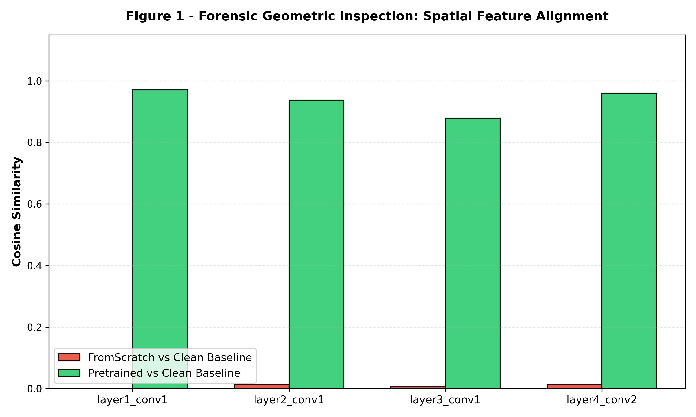
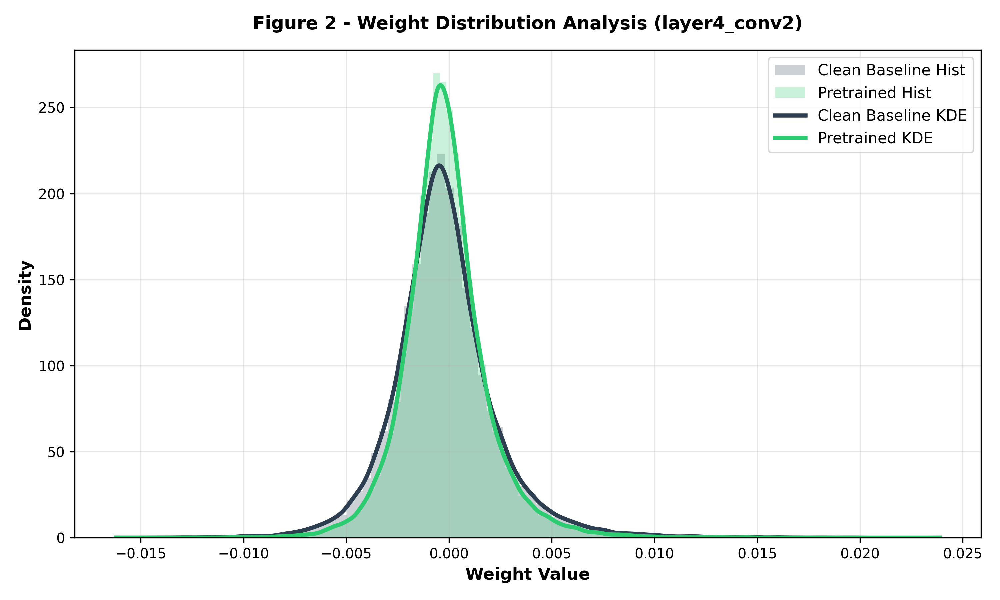
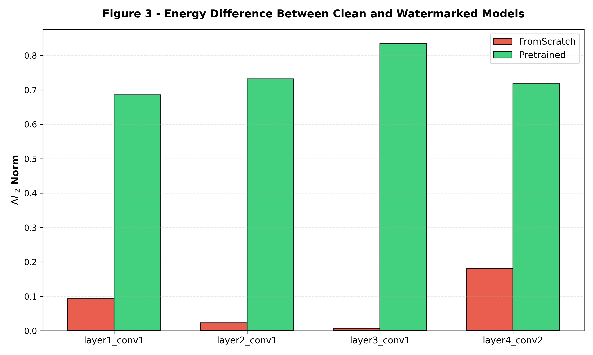
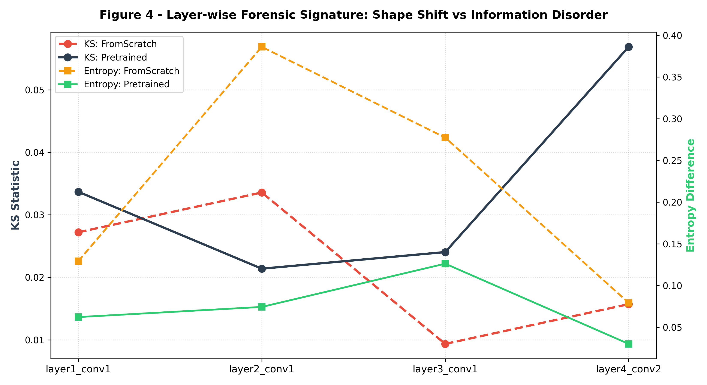

# Deep Learning Watermarking Project (USENIX Security 2018)

  

This repository contains the implementation, forensic evaluation, and security stress-testing of the Deep Neural Network (DNN) watermarking framework introduced by **Adi et al. (USENIX Security 2018)**. The project demonstrates how the over-parameterization of Deep Learning models can be actively exploited to embed a digital signature (watermark) in the form of a logical backdoor, ensuring robust Intellectual Property Protection with negligible impact on primary task accuracy.

  

---

  

## 📌 Methodological Overview

  

1. **The Primary Task:** The model uses a **ResNet-18** architecture adapted to classify images from the **CIFAR-10** dataset. To preserve spatial resolution for `32 × 32` inputs, the native `7 × 7` convolutional layer (stride 2) was replaced with a `3 × 3` kernel (stride 1), and the max-pooling layer was removed.
2. **The Watermark (Trigger Set):** We created a set of 100 abstract images and assigned completely random labels to them. If the network sees one of these abstract images during testing, it must "activate" and predict the specific random label.
3. **Training Paradigms (`src/train.py`):**

    * **NO-WM (Baseline):** A normal model trained without any watermark, used as a control group. 
    * **FROMSCRATCH (Joint Training):** The model learns the normal CIFAR-10 images and the watermark images together from the very beginning. 
    * **PRETRAINED (Fine-Tuning):** The watermark is injected at the end of the process by fine-tuning a model that was already fully trained on clean data.


  

---

  

## ⚔️ Adversarial Vulnerability & Stress-Testing (`src/attack.py`)

  

To evaluate watermark persistence and unremovability, protected models are exposed to three distinct removal attack taxonomies using exclusively clean data:

  

* **Fine-Tuning & Re-Training Variations (Paper Baseline):** Models are subjected to 5 epochs of optimization under four standard setups: **FTLL**, **FTAL**, **RTLL**, and **RTAL**, trying to remove the watermark.

* **Zero-mean Gaussian noise:** Random noise is injected directly into the network weights. The perturbation is scaled both by three target intensity factors ($0.01, 0.05, 0.10$) and by each layer's native standard deviation to evaluate if the signature gets corrupted without destroying main task performance.

* **Fine-Pruning (State-of-the-Art Attack):** The attacker analyzes the network to find the dormant channels across a progressive pruning range (**10%, 30%, and 50%**), zeroes them out permanently to delete the watermark, and then performs a 3-epoch fine-tuning phase to recover the model's accuracy. 
  

---

  

## 📊 Forensic Parameter Analysis (`src/weight_analysis.py`)

  

This module analyzes the weights of the models to study the mathematical fingerprint that the watermark leaves inside the network parameters. It compares the watermarked models with the clean baseline using four metrics:
  

* **Kolmogorov-Smirnov (KS) Test:** Checks if the shape of the weight distribution has shifted.

* **Cosine Similarity:** Measures the geometric alignment of the network filters.
* **$\Delta L_2$ Norm Difference:** Calculates the difference in "energy" and magnitude of the weights.

* **Shannon Entropy Discrepancy:** Evaluates information disorder and uncertainty shifts within the parameter density distribution. 

---

  

## 📈 Experimental Results

  

Below are the diagnostic charts automatically exported to the `results/` directory during the forensic analysis phase:

  

### Figure 1: Spatial Feature Alignment (Cosine Similarity)



  

### Figure 2: Weight Distribution Density Analysis (layer4_conv2)



  

### Figure 3: Energy Drift ($\Delta L_2$ Norm Difference)



  

### Figure 4: Layer-wise Forensic Signature (KS Stat vs Entropy)



  

---

  

## 🚀 How to Run the Project

  

To fully reproduce the experimental pipeline from scratch, execute the following modules in sequence from the root directory:

  

Generate the Watermark Trigger Set:

  

```bash

python generate_trigger.py

```

Move into the source directory (Required for relative paths)

```bash

cd src

```

Train Baseline and Watermarked Configurations:

```bash

python train.py

```

Execute the Security Stress-Testing Suite:

  

```bash

python attacks.py

```

Run Forensic Analysis and Export Charts:

  

```bash

python weight_analysis.py

```